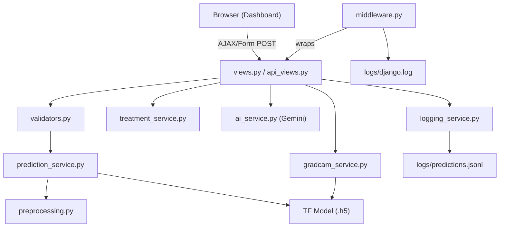

# Nabtati — Production Transformation Walkthrough

## What Changed

### 1. Service Layer Architecture (5 new modules)

| File | Purpose | Key Features |
|------|---------|--------------|
| [prediction_service.py](file:///c:/Users/bari/Desktop/projer-main/Plants_XAI_HSI_Detection-main/analysis/services/prediction_service.py) | Model inference | Lazy loading, thread-safe singleton, confidence thresholds, `PredictionResult` dataclass |
| [gradcam_service.py](file:///c:/Users/bari/Desktop/projer-main/Plants_XAI_HSI_Detection-main/analysis/services/gradcam_service.py) | Explainability | Fixed gradient flow with `tape.watch()`, `tf.keras.Model` sub-model, Gaussian blur smoothing |
| [preprocessing.py](file:///c:/Users/bari/Desktop/projer-main/Plants_XAI_HSI_Detection-main/analysis/services/preprocessing.py) | Image pipeline | Magic bytes validation, EXIF orientation fix, consistent resize/normalize |
| [treatment_service.py](file:///c:/Users/bari/Desktop/projer-main/Plants_XAI_HSI_Detection-main/analysis/services/treatment_service.py) | Recommendations | Treatment lookup, rule-based advisor, doctor reports, evolution comparison |
| [logging_service.py](file:///c:/Users/bari/Desktop/projer-main/Plants_XAI_HSI_Detection-main/analysis/services/logging_service.py) | Monitoring | JSONL prediction logging, performance tracker (avg/p95), error logging |

**Before**: 922-line monolithic `ml_utils.py` mixing everything.  
**After**: `ml_utils.py` is a thin 280-line facade that re-exports from services. Research functions for Jupyter remain.

---

### 2. Security & Validation

| File | Changes |
|------|---------|
| [validators.py](file:///c:/Users/bari/Desktop/projer-main/Plants_XAI_HSI_Detection-main/analysis/validators.py) | `validate_image_upload()` — size/type/extension checks, `sanitize_filename()` — path traversal prevention, `validate_scan_save_data()` — POST data sanitization |
| [middleware.py](file:///c:/Users/bari/Desktop/projer-main/Plants_XAI_HSI_Detection-main/analysis/middleware.py) | `RequestLoggingMiddleware` — method/path/duration/user logging, `SecurityHeadersMiddleware` — X-Content-Type-Options, Referrer-Policy, Permissions-Policy, `UploadRateLimitMiddleware` — 15 uploads/min/IP |
| [settings.py](file:///c:/Users/bari/Desktop/projer-main/Plants_XAI_HSI_Detection-main/config/settings.py) | Production security toggles (HSTS, SSL redirect, cookie security), `ALLOWED_HOSTS` from env, file upload limits (10MB), ML config settings, rotating file log handler |

---

### 3. Views & API Refactoring

| File | Changes |
|------|---------|
| [api_views.py](file:///c:/Users/bari/Desktop/projer-main/Plants_XAI_HSI_Detection-main/analysis/api_views.py) | **NEW** — `POST /api/predict/` (AJAX prediction + Grad-CAM), `POST /api/predict/ai-report/` (lazy AI report), `GET /api/stats/` (performance metrics) |
| [views.py](file:///c:/Users/bari/Desktop/projer-main/Plants_XAI_HSI_Detection-main/analysis/views.py) | Refactored to use service layer, added `@login_required` on protected views, server-side file validation on every upload, structured error handling with `log_error()` |
| [urls.py](file:///c:/Users/bari/Desktop/projer-main/Plants_XAI_HSI_Detection-main/analysis/urls.py) | Added `api/` routes for AJAX endpoints |

---

### 4. Frontend Enhancements

```diff:dashboard.html



Nabtati | Premium Diagnostic Dashboard
AI-Powered Plant Disease Detection Dashboard
Disease Diagnostics
Upload a leaf image to detect plant diseases with AI precision

active
aria-current="page"
active


    /* Grid Layout */
    .grid {
        display: grid;
        grid-template-columns: repeat(12, 1fr);
        gap: 24px;
    }

    /* Upload Zone */
    .upload-zone {
        grid-column: span 4;
        min-height: 240px;
        border: 2px dashed var(--border);
        display: flex;
        flex-direction: column;
        align-items: center;
        justify-content: center;
        gap: 12px;
        cursor: pointer;
        transition: var(--transition-normal);
        position: relative;
        overflow: hidden;
    }

    .upload-zone:hover, .upload-zone.drag-over {
        border-color: var(--primary);
        background: var(--primary-bg);
        transform: translateY(-3px);
        box-shadow: var(--shadow-lg);
    }

    .upload-zone.drag-over {
        border-style: solid;
        animation: pulseGlow 1.5s infinite;
    }

    @keyframes pulseGlow {
        0%, 100% { box-shadow: 0 0 0 0 var(--primary-glow); }
        50% { box-shadow: 0 0 0 12px rgba(46, 125, 50, 0); }
    }

    .upload-input {
        position: absolute;
        width: 100%;
        height: 100%;
        opacity: 0;
        cursor: pointer;
        z-index: 5;
    }

    .upload-icon {
        font-size: 42px;
        color: var(--primary);
        transition: transform 0.3s var(--ease-spring);
    }

    .upload-zone:hover .upload-icon { transform: translateY(-6px) scale(1.1); }

    .upload-text {
        font-size: 16px;
        font-weight: 700;
        color: var(--text-main);
    }

    .upload-hint {
        font-size: 13px;
        color: var(--text-muted);
    }

    /* Preview Cards */
    .preview-card { grid-column: span 4; }

    .preview-container {
        position: relative;
        border-radius: var(--radius-md);
        overflow: hidden;
        background: var(--bg-color);
        border: 1px solid var(--border);
        aspect-ratio: 4/3;
        display: flex;
        align-items: center;
        justify-content: center;
    }

    .preview-label {
        position: absolute;
        top: 12px; left: 12px;
        background: rgba(15, 23, 42, 0.8);
        backdrop-filter: blur(8px);
        color: white;
        padding: 6px 14px;
        border-radius: var(--radius-full);
        font-size: 11px;
        font-weight: 700;
        letter-spacing: 0.5px;
        text-transform: uppercase;
        display: flex;
        align-items: center;
        gap: 6px;
        z-index: 5;
    }

    .preview-label.gradcam { background: rgba(239, 68, 68, 0.85); }

    .preview-image {
        width: 100%;
        height: 100%;
        object-fit: cover;
        transition: transform 0.4s ease;
    }

    .preview-container:hover .preview-image { transform: scale(1.03); }

    .preview-placeholder {
        display: flex;
        flex-direction: column;
        align-items: center;
        gap: 12px;
        color: var(--text-muted);
        font-size: 14px;
        font-weight: 500;
    }

    /* Results Section */
    .results-section { animation: slideUp 0.5s ease forwards; }

    .result-card {
        background: var(--surface);
        border-radius: var(--radius-lg);
        padding: 32px;
        box-shadow: var(--shadow-lg);
        border: 1px solid var(--border);
        margin-top: 8px;
    }

    .result-header {
        display: flex;
        justify-content: space-between;
        align-items: center;
        padding-bottom: 20px;
        border-bottom: 1px solid var(--border);
        margin-bottom: 24px;
        flex-wrap: wrap;
        gap: 12px;
    }

    .disease-name {
        font-size: 26px;
        font-weight: 900;
        color: var(--primary-dark);
        display: flex;
        align-items: center;
        gap: 12px;
    }

    [data-theme="dark"] .disease-name { color: var(--primary-light); }
    .disease-name i { font-size: 22px; }

    .confidence-badge {
        background: linear-gradient(135deg, var(--primary), var(--primary-dark));
        color: white;
        padding: 10px 22px;
        border-radius: var(--radius-full);
        font-weight: 800;
        font-size: 15px;
        display: flex;
        align-items: center;
        gap: 8px;
        box-shadow: 0 4px 12px rgba(46, 125, 50, 0.3);
    }

    /* Progress Section */
    .progress-section { margin-bottom: 24px; }

    .progress-header {
        display: flex;
        justify-content: space-between;
        align-items: center;
        margin-bottom: 10px;
    }

    .progress-label { font-weight: 700; font-size: 14px; color: var(--text-main); }
    .progress-value { font-weight: 800; font-size: 14px; color: var(--primary); }

    /* Stage Box */
    .stage-box {
        background: var(--bg-color);
        padding: 18px 24px;
        border-radius: var(--radius-md);
        border: 1px solid var(--border);
        margin-bottom: 20px;
    }

    .stage-label {
        font-size: 12px; font-weight: 700; text-transform: uppercase;
        letter-spacing: 0.5px; color: var(--text-muted); margin-bottom: 6px;
    }

    .stage-value { font-size: 18px; font-weight: 800; color: var(--text-main); }
    .stage-value span { color: var(--danger); }

    /* Action Button */
    .action-btn {
        display: inline-flex;
        align-items: center;
        gap: 8px;
        padding: 14px 24px;
        background: linear-gradient(135deg, #6366f1, #4f46e5);
        color: white;
        border-radius: var(--radius-sm);
        font-weight: 700; font-size: 14px;
        text-decoration: none;
        margin-bottom: 28px;
        transition: var(--transition-fast);
        box-shadow: 0 4px 12px rgba(99, 102, 241, 0.3);
    }

    .action-btn:hover {
        transform: translateY(-2px);
        box-shadow: 0 8px 24px rgba(99, 102, 241, 0.4);
    }

    /* Recommendations */
    .reco-box {
        background: var(--bg-color);
        border-radius: var(--radius-md);
        padding: 24px;
        border: 1px solid var(--border);
        margin-bottom: 28px;
    }

    .reco-title {
        font-size: 16px; font-weight: 800; color: var(--text-main);
        margin-bottom: 16px;
        display: flex; align-items: center; gap: 10px;
    }

    .reco-title i { color: var(--primary); }

    .reco-list {
        list-style: none; padding: 0;
        display: flex; flex-direction: column; gap: 10px;
    }

    .reco-list li {
        display: flex; align-items: flex-start; gap: 10px;
        padding: 10px 14px;
        background: var(--surface);
        border-radius: var(--radius-sm);
        font-weight: 500; font-size: 14px;
        color: var(--text-main);
        border: 1px solid var(--border);
        transition: var(--transition-fast);
    }

    .reco-list li:hover {
        border-color: var(--primary);
        transform: translateX(4px);
    }

    .reco-list li::before {
        content: '\f058';
        font-family: 'Font Awesome 6 Free';
        font-weight: 900;
        color: var(--primary);
        flex-shrink: 0; margin-top: 1px;
    }

    /* AI Report */
    .ai-report {
        margin-top: 32px; padding-top: 28px;
        border-top: 1px solid var(--border);
    }

    .ai-report-title {
        font-size: 20px; font-weight: 800; color: var(--text-main);
        margin-bottom: 20px;
        display: flex; align-items: center; gap: 10px;
    }

    .ai-report-title i { color: var(--info); }

    .report-grid {
        display: grid;
        grid-template-columns: 1fr 1fr;
        gap: 16px; margin-bottom: 28px;
    }

    @media (max-width: 768px) { .report-grid { grid-template-columns: 1fr; } }

    .report-box {
        background: var(--bg-color);
        padding: 20px;
        border-radius: var(--radius-md);
        border: 1px solid var(--border);
        border-left: 4px solid var(--primary);
        transition: var(--transition-fast);
    }

    .report-box:hover {
        transform: translateY(-2px);
        box-shadow: var(--shadow-md);
    }

    .report-box.risk { border-left-color: var(--danger); }

    .report-box h4 {
        font-size: 14px; font-weight: 800; color: var(--text-main);
        margin-bottom: 10px;
        display: flex; align-items: center; gap: 8px;
    }

    .report-box h4 i { color: var(--primary); font-size: 14px; }
    .report-box.risk h4 i { color: var(--danger); }

    .report-box p {
        color: var(--text-muted); font-size: 14px; line-height: 1.6;
    }

    /* Yield Card */
    .yield-card {
        background: var(--bg-color);
        border-radius: var(--radius-md);
        padding: 20px;
        border: 1px solid var(--border);
        margin-bottom: 24px;
    }

    .yield-header {
        display: flex; justify-content: space-between; align-items: center;
        margin-bottom: 14px; font-weight: 700; font-size: 14px; color: var(--text-main);
    }

    .yield-badge {
        background: var(--danger-bg); color: var(--danger);
        padding: 4px 14px; border-radius: var(--radius-full);
        font-size: 13px; font-weight: 700;
    }

    .yield-track {
        height: 10px; background: var(--border);
        border-radius: var(--radius-full); overflow: hidden;
    }

    .yield-fill {
        height: 100%;
        background: linear-gradient(90deg, var(--warning), var(--danger));
        border-radius: var(--radius-full);
        transition: width 1s ease;
    }

    .yield-desc { margin-top: 10px; font-size: 13px; color: var(--text-muted); }

    /* Fungicide Card */
    .fungicide-card {
        background: var(--bg-color);
        border-radius: var(--radius-md);
        padding: 20px;
        border: 1px solid var(--border);
    }

    .fungicide-title {
        font-size: 16px; font-weight: 800; margin-bottom: 16px;
        color: var(--text-main);
        display: flex; align-items: center; gap: 8px;
    }

    .fungicide-title i { color: var(--info); }

    .fungicide-table { width: 100%; border-collapse: collapse; }

    .fungicide-table th {
        text-align: left; font-size: 11px; color: var(--text-muted);
        text-transform: uppercase; letter-spacing: 0.5px;
        padding: 10px 8px; border-bottom: 2px solid var(--border);
    }

    .fungicide-table td {
        padding: 14px 8px; border-bottom: 1px solid var(--border);
        font-weight: 600; color: var(--text-main); font-size: 14px;
    }

    .mode-badge {
        background: var(--primary-bg); color: var(--primary-dark);
        padding: 4px 12px; border-radius: var(--radius-full);
        font-size: 12px; font-weight: 700;
    }

    /* Save Form */
    .save-form {
        display: flex; gap: 12px; align-items: center;
        margin-top: 28px; padding-top: 24px;
        border-top: 1px solid var(--border); flex-wrap: wrap;
    }

    .save-input {
        flex: 1; min-width: 200px;
        padding: 12px 18px;
        border: 2px solid var(--border);
        border-radius: var(--radius-sm);
        font-size: 14px; font-family: inherit; font-weight: 500;
        background: var(--surface); color: var(--text-main);
        transition: var(--transition-fast);
    }

    .save-input:focus {
        outline: none; border-color: var(--primary);
        box-shadow: var(--shadow-glow);
    }

    .save-input::placeholder { color: var(--text-muted); }

    /* Modal Buttons */
    .modal-btn {
        padding: 12px 24px;
        border-radius: var(--radius-sm);
        font-weight: 700; font-size: 14px;
        cursor: pointer; border: none;
        transition: var(--transition-fast);
        font-family: inherit;
    }

    .modal-btn.cancel {
        background: var(--bg-color); color: var(--text-main);
        border: 1px solid var(--border);
    }

    .modal-btn.cancel:hover { background: var(--border); }

    .modal-btn.confirm {
        background: linear-gradient(135deg, var(--primary), var(--primary-dark));
        color: white;
        box-shadow: 0 4px 12px rgba(46, 125, 50, 0.3);
    }

    .modal-btn.confirm:hover { transform: translateY(-2px); }

    .modal-btn.danger { background: var(--danger); color: white; }
    .modal-btn.danger:hover { background: #dc2626; }

    /* Responsive */
    @media (max-width: 1024px) {
        .upload-zone, .preview-card { grid-column: span 6; }
    }

    @media (max-width: 640px) {
        .upload-zone, .preview-card { grid-column: span 12; }
        .save-form { flex-direction: column; align-items: stretch; }
        .result-card { padding: 24px 20px; }
        .disease-name { font-size: 20px; }
    }



    <div class="grid">
        <!-- Upload Zone -->
        <div class="card upload-zone" id="uploadZone" role="button" tabindex="0" aria-label="Upload plant image">
            <form method="POST" enctype="multipart/form-data" id="uploadForm" style="position:absolute;inset:0;z-index:10;">
                
                <input type="file" name="image" class="upload-input" accept="image/*" capture="environment" aria-label="Select image file" onchange="handleFileSelect(event)">
            </form>
            <i class="fas fa-cloud-arrow-up upload-icon"></i>
            <p class="upload-text">Drop image here</p>
            <p class="upload-hint">or click to browse &bull; JPG, PNG up to 10MB</p>
        </div>

        <!-- Original Preview -->
        <div class="card preview-card">
            <h3 class="card-title"><i class="fas fa-image"></i> Original Image</h3>
            <div class="preview-container">
                <span class="preview-label"><i class="fas fa-camera"></i> Input</span>
                
                    
                
                    <div class="preview-placeholder">
                        <i class="fas fa-image fa-3x" style="color:var(--border);"></i>
                        <span>No image uploaded</span>
                    </div>
                
            </div>
        </div>

        <!-- Grad-CAM Preview -->
        <div class="card preview-card">
            <h3 class="card-title"><i class="fas fa-fire"></i> Grad-CAM Analysis</h3>
            <div class="preview-container">
                <span class="preview-label gradcam"><i class="fas fa-bolt"></i> Heatmap</span>
                
                    
                
                    <div class="preview-placeholder">
                        <i class="fas fa-microscope fa-3x" style="color:var(--border);"></i>
                        <span>Waiting for analysis...</span>
                    </div>
                
            </div>
        </div>
    </div>

    <!-- AI Results Section -->
    
    <section class="results-section" id="resultBox" aria-live="polite">
        <div class="result-card">
            <div class="result-header">
                <h2 class="disease-name">
                    <i class="fas fa-leaf"></i>
                    {{ result.disease }}
                </h2>
                <div class="confidence-badge">
                    <i class="fas fa-check-circle"></i>
                    {{ result.confidence }}
                </div>
            </div>

            <!-- Confidence Progress -->
            <div class="progress-section">
                <div class="progress-header">
                    <span class="progress-label">Model Confidence</span>
                    <span class="progress-value" id="confidenceValue">{{ result.confidence }}</span>
                </div>
                <div class="progress-track">
                    <div class="progress-fill" id="confidenceBar" style="width: {{ result.confidence }};"></div>
                </div>
            </div>

            <!-- Disease Stage -->
            <div class="stage-box">
                <div class="stage-label">Disease Progression</div>
                <div class="stage-value">
                    {{ progress_stage }} — <span>{{ progress_ratio }}%</span>
                </div>
            </div>

            <a href="?img={{ gradcam_url }}&ratio={{ progress_ratio }}&stage={{ progress_stage }}"
               class="action-btn"
               aria-label="View detailed analytics for {{ result.disease }}">
                <i class="fas fa-microscope"></i> View Detailed Analytics
            </a>

            <!-- Recommendations -->
            <div class="reco-box">
                <h3 class="reco-title">
                    <i class="fas fa-clipboard-list"></i>
                    Immediate Treatment Recommendations
                </h3>
                <ul class="reco-list">
                    
                        <li>{{ r }}</li>
                    
                </ul>
            </div>

            <!-- AI Agronomic Report -->
            
            <div class="ai-report">
                <h3 class="ai-report-title">
                    <i class="fas fa-robot"></i> AI Agronomic Intelligence Report
                </h3>

                <div class="report-grid">
                    <div class="report-box">
                        <h4><i class="fas fa-stethoscope"></i> Medical Diagnosis</h4>
                        <p>{{ ai_report.medical }}</p>
                    </div>
                    <div class="report-box">
                        <h4><i class="fas fa-pills"></i> Treatment Strategy</h4>
                        <p>{{ ai_report.treatment }}</p>
                    </div>
                    <div class="report-box">
                        <h4><i class="fas fa-tint"></i> Irrigation Plan</h4>
                        <p>{{ ai_report.irrigation }}</p>
                    </div>
                    <div class="report-box risk">
                        <h4><i class="fas fa-chart-line"></i> Economic Risk</h4>
                        <p>{{ ai_report.economic_risk }}</p>
                    </div>
                </div>

                <!-- Yield Loss -->
                <div class="yield-card">
                    <div class="yield-header">
                        <span><i class="fas fa-arrow-trend-down"></i> Yield Loss Prediction</span>
                        <span class="yield-badge">{{ ai_report.yield_loss_percent }}% Loss</span>
                    </div>
                    <div class="yield-track">
                        <div class="yield-fill" id="yieldBar" style="width: {{ ai_report.yield_loss_percent }}%;"></div>
                    </div>
                    <p class="yield-desc">Estimated production reduction based on AI disease severity analysis.</p>
                </div>

                <!-- Fungicides Table -->
                <div class="fungicide-card">
                    <h4 class="fungicide-title">
                        <i class="fas fa-flask"></i> Recommended Fungicides
                    </h4>
                    <table class="fungicide-table" role="table">
                        <thead>
                            <tr>
                                <th scope="col">Product Name</th>
                                <th scope="col">Action Mode</th>
                            </tr>
                        </thead>
                        <tbody>
                            
                            <tr>
                                <td>{{ f.name }}</td>
                                <td><span class="mode-badge">{{ f.type }}</span></td>
                            </tr>
                            
                        </tbody>
                    </table>
                </div>
            </div>
            

            <!-- Save Form -->
            <form method="POST" id="saveForm" action="" class="save-form">
                
                <input type="text" name="folder_name" placeholder="Name this scan (e.g., Field A - Row 2)" required class="save-input" aria-label="Scan folder name">

                <button type="button" onclick="openSaveModal()" class="btn btn-primary">
                    <i class="fas fa-save"></i> Save Report
                </button>
                <button type="button" onclick="openDeleteModal()" class="btn btn-danger">
                    <i class="fas fa-trash"></i> Discard
                </button>

                <!-- Hidden fields -->
                <input type="hidden" name="prediction" value="{{ result.disease }}">
                <input type="hidden" name="confidence" value="{{ result.confidence }}">
                <input type="hidden" name="ratio" value="{{ progress_ratio }}">
                <input type="hidden" name="stage" value="{{ progress_stage }}">
                <input type="hidden" name="orig" value="{{ image_url }}">
                <input type="hidden" name="gradcam" value="{{ gradcam_url }}">
                
                <input type="hidden" name="ai_medical" value="{{ ai_report.medical }}">
                <input type="hidden" name="ai_treatment" value="{{ ai_report.treatment }}">
                <input type="hidden" name="ai_irrigation" value="{{ ai_report.irrigation }}">
                <input type="hidden" name="ai_economic" value="{{ ai_report.economic_risk }}">
                <input type="hidden" name="yield_loss" value="{{ ai_report.yield_loss_percent }}">
                <input type="hidden" name="fungicides_json" value='{{ ai_report.fungicides|safe }}'>
                
            </form>
        </div>
    </section>
    

    <!-- Save Modal -->
    <div class="modal" id="saveModal" role="dialog" aria-modal="true" aria-labelledby="saveModalTitle">
        <div class="modal-content">
            <div class="modal-icon"><i class="fas fa-cloud-arrow-up"></i></div>
            <h3 class="modal-title" id="saveModalTitle">Save AI Report</h3>
            <p class="modal-text">Do you want to securely save this diagnostic report to your files for future reference?</p>
            <div class="modal-actions">
                <button class="modal-btn cancel" onclick="closeModal('saveModal')">Cancel</button>
                <button class="modal-btn confirm" onclick="saveScanAjax()">
                    <i class="fas fa-check"></i> Yes, Save Report
                </button>
            </div>
        </div>
    </div>

    <!-- Delete Modal -->
    <div class="modal" id="deleteModal" role="dialog" aria-modal="true" aria-labelledby="deleteModalTitle">
        <div class="modal-content">
            <div class="modal-icon" style="background:var(--danger-bg);color:var(--danger);">
                <i class="fas fa-trash"></i>
            </div>
            <h3 class="modal-title" id="deleteModalTitle">Discard Analysis</h3>
            <p class="modal-text">This will remove the current results. You will need to re-upload to scan again.</p>
            <div class="modal-actions">
                <button class="modal-btn cancel" onclick="closeModal('deleteModal')">Cancel</button>
                <button class="modal-btn danger" onclick="deleteResult()">
                    <i class="fas fa-check"></i> Discard Results
                </button>
            </div>
        </div>
    </div>



    <script>
        // ===== DRAG & DROP =====
        document.addEventListener('DOMContentLoaded', () => {
            setupDragDrop('uploadZone');
            animateProgressBars();
        });

        // ===== FILE HANDLING =====
        function handleFileSelect(event) {
            const file = event.target.files[0];
            if (!file) return;

            if (!file.type.match('image.*')) {
                showToast('Please select a valid image file', 'error');
                event.target.value = '';
                return;
            }

            if (file.size > 10 * 1024 * 1024) {
                showToast('File too large. Max 10MB allowed', 'error');
                event.target.value = '';
                return;
            }

            showLoading('Analyzing plant image...');
            event.target.form.submit();
        }

        // ===== MODAL MANAGEMENT =====
        function openSaveModal() {
            const input = document.querySelector('input[name="folder_name"]');
            if (!input?.value.trim()) {
                showToast('Please enter a name for this scan', 'warning');
                input?.focus();
                return;
            }
            showModal('saveModal');
        }

        function openDeleteModal() {
            showModal('deleteModal');
        }

        // ===== DELETE =====
        function deleteResult() {
            const resultBox = document.getElementById('resultBox');
            if (resultBox) {
                resultBox.style.animation = 'fadeOut 0.3s ease forwards';
                setTimeout(() => {
                    resultBox.remove();
                    showToast('Results discarded', 'success');
                }, 300);
            }
            closeModal('deleteModal');
        }

        // ===== AJAX SAVE =====
        function saveScanAjax() {
            const form = document.getElementById('saveForm');
            const formData = new FormData(form);
            const btn = form.querySelector('.btn-primary');

            const originalBtn = btn.innerHTML;
            btn.innerHTML = '<i class="fas fa-spinner fa-spin"></i> Saving...';
            btn.disabled = true;

            fetch(form.action, {
                method: 'POST',
                body: formData,
                headers: {
                    'X-CSRFToken': formData.get('csrfmiddlewaretoken')
                }
            })
            .then(async response => {
                if (!response.ok) {
                    const error = await response.json().catch(() => ({}));
                    throw new Error(error.message || 'Save failed');
                }
                return response.json();
            })
            .then(data => {
                closeModal('saveModal');
                showToast('Report saved successfully!', 'success');
                document.querySelector('input[name="folder_name"]').value = '';
            })
            .catch(error => {
                console.error('Save error:', error);
                showToast(`${error.message || 'Failed to save report'}`, 'error');
            })
            .finally(() => {
                btn.innerHTML = originalBtn;
                btn.disabled = false;
            });
        }

        // ===== PROGRESS BARS =====
        function animateProgressBars() {
            const confidenceBar = document.getElementById('confidenceBar');
            const confidenceValue = document.getElementById('confidenceValue');
            if (confidenceBar && confidenceValue) {
                const target = parseFloat(confidenceValue.textContent);
                confidenceBar.style.width = `${target}%`;
            }

            const yieldBar = document.getElementById('yieldBar');
            if (yieldBar) {
                const target = parseFloat(yieldBar.style.width);
                yieldBar.style.width = `${target}%`;
            }
        }

        // ===== KEYBOARD SHORTCUTS =====
        document.addEventListener('keydown', (e) => {
            if (e.ctrlKey || e.metaKey) {
                if (e.key === 's') {
                    e.preventDefault();
                    openSaveModal();
                }
                if (e.key === 'd') {
                    e.preventDefault();
                    openDeleteModal();
                }
            }
        });
    </script>

===



Nabtati | Premium Diagnostic Dashboard
AI-Powered Plant Disease Detection Dashboard
Disease Diagnostics
Upload a leaf image to detect plant diseases with AI precision

active
aria-current="page"
active


    /* Grid Layout */
    .grid {
        display: grid;
        grid-template-columns: repeat(12, 1fr);
        gap: 24px;
    }

    /* Upload Zone */
    .upload-zone {
        grid-column: span 4;
        min-height: 240px;
        border: 2px dashed var(--border);
        display: flex;
        flex-direction: column;
        align-items: center;
        justify-content: center;
        gap: 12px;
        cursor: pointer;
        transition: var(--transition-normal);
        position: relative;
        overflow: hidden;
    }

    .upload-zone:hover, .upload-zone.drag-over {
        border-color: var(--primary);
        background: var(--primary-bg);
        transform: translateY(-3px);
        box-shadow: var(--shadow-lg);
    }

    .upload-zone.drag-over {
        border-style: solid;
        animation: pulseGlow 1.5s infinite;
    }

    @keyframes pulseGlow {
        0%, 100% { box-shadow: 0 0 0 0 var(--primary-glow); }
        50% { box-shadow: 0 0 0 12px rgba(46, 125, 50, 0); }
    }

    .upload-input {
        position: absolute;
        width: 100%;
        height: 100%;
        opacity: 0;
        cursor: pointer;
        z-index: 5;
    }

    .upload-icon {
        font-size: 42px;
        color: var(--primary);
        transition: transform 0.3s var(--ease-spring);
    }

    .upload-zone:hover .upload-icon { transform: translateY(-6px) scale(1.1); }

    .upload-text {
        font-size: 16px;
        font-weight: 700;
        color: var(--text-main);
    }

    .upload-hint {
        font-size: 13px;
        color: var(--text-muted);
    }

    /* Upload Progress */
    .upload-progress {
        display: none;
        width: 80%;
        margin-top: 12px;
    }
    .upload-progress.show { display: block; }

    .upload-progress-track {
        height: 6px;
        background: var(--border);
        border-radius: var(--radius-full);
        overflow: hidden;
    }
    .upload-progress-fill {
        height: 100%;
        background: linear-gradient(90deg, var(--primary), var(--primary-light));
        border-radius: var(--radius-full);
        width: 0%;
        transition: width 0.3s ease;
    }
    .upload-progress-text {
        font-size: 12px;
        color: var(--text-muted);
        text-align: center;
        margin-top: 6px;
        font-weight: 600;
    }

    /* Preview Cards */
    .preview-card { grid-column: span 4; }

    .preview-container {
        position: relative;
        border-radius: var(--radius-md);
        overflow: hidden;
        background: var(--bg-color);
        border: 1px solid var(--border);
        aspect-ratio: 4/3;
        display: flex;
        align-items: center;
        justify-content: center;
    }

    .preview-label {
        position: absolute;
        top: 12px; left: 12px;
        background: rgba(15, 23, 42, 0.8);
        backdrop-filter: blur(8px);
        color: white;
        padding: 6px 14px;
        border-radius: var(--radius-full);
        font-size: 11px;
        font-weight: 700;
        letter-spacing: 0.5px;
        text-transform: uppercase;
        display: flex;
        align-items: center;
        gap: 6px;
        z-index: 5;
    }

    .preview-label.gradcam { background: rgba(239, 68, 68, 0.85); }

    .preview-image {
        width: 100%;
        height: 100%;
        object-fit: cover;
        transition: transform 0.4s ease;
    }

    .preview-container:hover .preview-image { transform: scale(1.03); }

    .preview-placeholder {
        display: flex;
        flex-direction: column;
        align-items: center;
        gap: 12px;
        color: var(--text-muted);
        font-size: 14px;
        font-weight: 500;
    }

    /* Low Confidence Warning */
    .low-confidence-banner {
        background: var(--warning-bg);
        border: 1px solid var(--warning-border);
        border-radius: var(--radius-md);
        padding: 16px 20px;
        margin-bottom: 20px;
        display: flex;
        align-items: center;
        gap: 12px;
        animation: slideUp 0.3s ease;
    }
    .low-confidence-banner i {
        font-size: 24px;
        color: var(--warning);
        flex-shrink: 0;
    }
    .low-confidence-banner .banner-text {
        font-size: 14px;
        font-weight: 600;
        color: var(--text-main);
    }
    .low-confidence-banner .banner-detail {
        font-size: 13px;
        color: var(--text-muted);
        margin-top: 2px;
    }

    /* Results Section */
    .results-section { animation: slideUp 0.5s ease forwards; }

    .result-card {
        background: var(--surface);
        border-radius: var(--radius-lg);
        padding: 32px;
        box-shadow: var(--shadow-lg);
        border: 1px solid var(--border);
        margin-top: 8px;
    }

    .result-header {
        display: flex;
        justify-content: space-between;
        align-items: center;
        padding-bottom: 20px;
        border-bottom: 1px solid var(--border);
        margin-bottom: 24px;
        flex-wrap: wrap;
        gap: 12px;
    }

    .disease-name {
        font-size: 26px;
        font-weight: 900;
        color: var(--primary-dark);
        display: flex;
        align-items: center;
        gap: 12px;
    }

    [data-theme="dark"] .disease-name { color: var(--primary-light); }
    .disease-name i { font-size: 22px; }

    .confidence-badge {
        background: linear-gradient(135deg, var(--primary), var(--primary-dark));
        color: white;
        padding: 10px 22px;
        border-radius: var(--radius-full);
        font-weight: 800;
        font-size: 15px;
        display: flex;
        align-items: center;
        gap: 8px;
        box-shadow: 0 4px 12px rgba(46, 125, 50, 0.3);
    }
    .confidence-badge.low {
        background: linear-gradient(135deg, var(--warning), #d97706);
        box-shadow: 0 4px 12px rgba(245, 158, 11, 0.3);
    }

    /* Inference Timing */
    .timing-badge {
        font-size: 12px;
        color: var(--text-muted);
        font-weight: 600;
        display: flex;
        align-items: center;
        gap: 6px;
    }
    .timing-badge i { font-size: 11px; }

    /* Progress Section */
    .progress-section { margin-bottom: 24px; }

    .progress-header {
        display: flex;
        justify-content: space-between;
        align-items: center;
        margin-bottom: 10px;
    }

    .progress-label { font-weight: 700; font-size: 14px; color: var(--text-main); }
    .progress-value { font-weight: 800; font-size: 14px; color: var(--primary); }

    /* Stage Box */
    .stage-box {
        background: var(--bg-color);
        padding: 18px 24px;
        border-radius: var(--radius-md);
        border: 1px solid var(--border);
        margin-bottom: 20px;
    }

    .stage-label {
        font-size: 12px; font-weight: 700; text-transform: uppercase;
        letter-spacing: 0.5px; color: var(--text-muted); margin-bottom: 6px;
    }

    .stage-value { font-size: 18px; font-weight: 800; color: var(--text-main); }
    .stage-value span { color: var(--danger); }

    /* Action Button */
    .action-btn {
        display: inline-flex;
        align-items: center;
        gap: 8px;
        padding: 14px 24px;
        background: linear-gradient(135deg, #6366f1, #4f46e5);
        color: white;
        border-radius: var(--radius-sm);
        font-weight: 700; font-size: 14px;
        text-decoration: none;
        margin-bottom: 28px;
        transition: var(--transition-fast);
        box-shadow: 0 4px 12px rgba(99, 102, 241, 0.3);
    }

    .action-btn:hover {
        transform: translateY(-2px);
        box-shadow: 0 8px 24px rgba(99, 102, 241, 0.4);
    }

    /* Recommendations */
    .reco-box {
        background: var(--bg-color);
        border-radius: var(--radius-md);
        padding: 24px;
        border: 1px solid var(--border);
        margin-bottom: 28px;
    }

    .reco-title {
        font-size: 16px; font-weight: 800; color: var(--text-main);
        margin-bottom: 16px;
        display: flex; align-items: center; gap: 10px;
    }

    .reco-title i { color: var(--primary); }

    .reco-list {
        list-style: none; padding: 0;
        display: flex; flex-direction: column; gap: 10px;
    }

    .reco-list li {
        display: flex; align-items: flex-start; gap: 10px;
        padding: 10px 14px;
        background: var(--surface);
        border-radius: var(--radius-sm);
        font-weight: 500; font-size: 14px;
        color: var(--text-main);
        border: 1px solid var(--border);
        transition: var(--transition-fast);
    }

    .reco-list li:hover {
        border-color: var(--primary);
        transform: translateX(4px);
    }

    .reco-list li::before {
        content: '\f058';
        font-family: 'Font Awesome 6 Free';
        font-weight: 900;
        color: var(--primary);
        flex-shrink: 0; margin-top: 1px;
    }

    /* AI Report */
    .ai-report {
        margin-top: 32px; padding-top: 28px;
        border-top: 1px solid var(--border);
    }

    .ai-report-title {
        font-size: 20px; font-weight: 800; color: var(--text-main);
        margin-bottom: 20px;
        display: flex; align-items: center; gap: 10px;
    }

    .ai-report-title i { color: var(--info); }

    /* AI Report Loading State */
    .ai-report-loading {
        text-align: center;
        padding: 40px 20px;
        color: var(--text-muted);
    }
    .ai-report-loading .spinner-ring {
        width: 36px; height: 36px;
        border: 3px solid var(--border);
        border-top-color: var(--info);
        border-radius: 50%;
        animation: spin 0.8s linear infinite;
        margin: 0 auto 16px;
    }
    @keyframes spin { to { transform: rotate(360deg); } }

    .report-grid {
        display: grid;
        grid-template-columns: 1fr 1fr;
        gap: 16px; margin-bottom: 28px;
    }

    @media (max-width: 768px) { .report-grid { grid-template-columns: 1fr; } }

    .report-box {
        background: var(--bg-color);
        padding: 20px;
        border-radius: var(--radius-md);
        border: 1px solid var(--border);
        border-left: 4px solid var(--primary);
        transition: var(--transition-fast);
    }

    .report-box:hover {
        transform: translateY(-2px);
        box-shadow: var(--shadow-md);
    }

    .report-box.risk { border-left-color: var(--danger); }

    .report-box h4 {
        font-size: 14px; font-weight: 800; color: var(--text-main);
        margin-bottom: 10px;
        display: flex; align-items: center; gap: 8px;
    }

    .report-box h4 i { color: var(--primary); font-size: 14px; }
    .report-box.risk h4 i { color: var(--danger); }

    .report-box p {
        color: var(--text-muted); font-size: 14px; line-height: 1.6;
    }

    /* Yield Card */
    .yield-card {
        background: var(--bg-color);
        border-radius: var(--radius-md);
        padding: 20px;
        border: 1px solid var(--border);
        margin-bottom: 24px;
    }

    .yield-header {
        display: flex; justify-content: space-between; align-items: center;
        margin-bottom: 14px; font-weight: 700; font-size: 14px; color: var(--text-main);
    }

    .yield-badge {
        background: var(--danger-bg); color: var(--danger);
        padding: 4px 14px; border-radius: var(--radius-full);
        font-size: 13px; font-weight: 700;
    }

    .yield-track {
        height: 10px; background: var(--border);
        border-radius: var(--radius-full); overflow: hidden;
    }

    .yield-fill {
        height: 100%;
        background: linear-gradient(90deg, var(--warning), var(--danger));
        border-radius: var(--radius-full);
        transition: width 1s ease;
    }

    .yield-desc { margin-top: 10px; font-size: 13px; color: var(--text-muted); }

    /* Fungicide Card */
    .fungicide-card {
        background: var(--bg-color);
        border-radius: var(--radius-md);
        padding: 20px;
        border: 1px solid var(--border);
    }

    .fungicide-title {
        font-size: 16px; font-weight: 800; margin-bottom: 16px;
        color: var(--text-main);
        display: flex; align-items: center; gap: 8px;
    }

    .fungicide-title i { color: var(--info); }

    .fungicide-table { width: 100%; border-collapse: collapse; }

    .fungicide-table th {
        text-align: left; font-size: 11px; color: var(--text-muted);
        text-transform: uppercase; letter-spacing: 0.5px;
        padding: 10px 8px; border-bottom: 2px solid var(--border);
    }

    .fungicide-table td {
        padding: 14px 8px; border-bottom: 1px solid var(--border);
        font-weight: 600; color: var(--text-main); font-size: 14px;
    }

    .mode-badge {
        background: var(--primary-bg); color: var(--primary-dark);
        padding: 4px 12px; border-radius: var(--radius-full);
        font-size: 12px; font-weight: 700;
    }

    /* Save Form */
    .save-form {
        display: flex; gap: 12px; align-items: center;
        margin-top: 28px; padding-top: 24px;
        border-top: 1px solid var(--border); flex-wrap: wrap;
    }

    .save-input {
        flex: 1; min-width: 200px;
        padding: 12px 18px;
        border: 2px solid var(--border);
        border-radius: var(--radius-sm);
        font-size: 14px; font-family: inherit; font-weight: 500;
        background: var(--surface); color: var(--text-main);
        transition: var(--transition-fast);
    }

    .save-input:focus {
        outline: none; border-color: var(--primary);
        box-shadow: var(--shadow-glow);
    }

    .save-input::placeholder { color: var(--text-muted); }

    /* Modal Buttons */
    .modal-btn {
        padding: 12px 24px;
        border-radius: var(--radius-sm);
        font-weight: 700; font-size: 14px;
        cursor: pointer; border: none;
        transition: var(--transition-fast);
        font-family: inherit;
    }

    .modal-btn.cancel {
        background: var(--bg-color); color: var(--text-main);
        border: 1px solid var(--border);
    }

    .modal-btn.cancel:hover { background: var(--border); }

    .modal-btn.confirm {
        background: linear-gradient(135deg, var(--primary), var(--primary-dark));
        color: white;
        box-shadow: 0 4px 12px rgba(46, 125, 50, 0.3);
    }

    .modal-btn.confirm:hover { transform: translateY(-2px); }

    .modal-btn.danger { background: var(--danger); color: white; }
    .modal-btn.danger:hover { background: #dc2626; }

    /* Responsive */
    @media (max-width: 1024px) {
        .upload-zone, .preview-card { grid-column: span 6; }
    }

    @media (max-width: 640px) {
        .upload-zone, .preview-card { grid-column: span 12; }
        .save-form { flex-direction: column; align-items: stretch; }
        .result-card { padding: 24px 20px; }
        .disease-name { font-size: 20px; }
    }



    <div class="grid">
        <!-- Upload Zone -->
        <div class="card upload-zone" id="uploadZone" role="button" tabindex="0" aria-label="Upload plant image">
            <form method="POST" enctype="multipart/form-data" id="uploadForm" style="position:absolute;inset:0;z-index:10;">
                
                <input type="file" name="image" class="upload-input" id="imageInput" accept="image/*" capture="environment" aria-label="Select image file" onchange="handleFileSelect(event)">
            </form>
            <i class="fas fa-cloud-arrow-up upload-icon" id="uploadIcon"></i>
            <p class="upload-text" id="uploadText">Drop image here</p>
            <p class="upload-hint" id="uploadHint">or click to browse &bull; JPG, PNG up to 10MB</p>

            <!-- Upload Progress -->
            <div class="upload-progress" id="uploadProgress">
                <div class="upload-progress-track">
                    <div class="upload-progress-fill" id="uploadProgressFill"></div>
                </div>
                <p class="upload-progress-text" id="uploadProgressText">Uploading...</p>
            </div>
        </div>

        <!-- Original Preview -->
        <div class="card preview-card" id="originalPreviewCard">
            <h3 class="card-title"><i class="fas fa-image"></i> Original Image</h3>
            <div class="preview-container" id="originalContainer">
                <span class="preview-label"><i class="fas fa-camera"></i> Input</span>
                
                    
                
                    <div class="preview-placeholder" id="originalPlaceholder">
                        <i class="fas fa-image fa-3x" style="color:var(--border);"></i>
                        <span>No image uploaded</span>
                    </div>
                
            </div>
        </div>

        <!-- Grad-CAM Preview -->
        <div class="card preview-card" id="gradcamPreviewCard">
            <h3 class="card-title"><i class="fas fa-fire"></i> Grad-CAM Analysis</h3>
            <div class="preview-container" id="gradcamContainer">
                <span class="preview-label gradcam"><i class="fas fa-bolt"></i> Heatmap</span>
                
                    
                
                    <div class="preview-placeholder" id="gradcamPlaceholder">
                        <i class="fas fa-microscope fa-3x" style="color:var(--border);"></i>
                        <span>Waiting for analysis...</span>
                    </div>
                
            </div>
        </div>
    </div>

    <!-- AI Results Section -->
    
    <section class="results-section" id="resultBox" aria-live="polite">
        <div class="result-card">
            <!-- Low Confidence Warning -->
            
            <div class="low-confidence-banner">
                <i class="fas fa-exclamation-triangle"></i>
                <div>
                    <div class="banner-text">Low Confidence Prediction</div>
                    <div class="banner-detail">
                        The model is not highly confident in this prediction ({{ result.confidence }}).
                        Consider re-scanning with a clearer image or consulting an expert.
                    </div>
                </div>
            </div>
            

            <div class="result-header">
                <h2 class="disease-name">
                    <i class="fas fa-leaf"></i>
                    {{ result.disease }}
                </h2>
                <div>
                    <div class="confidence-badge low">
                        <i class="fas fa-exclamation-trianglecheck-circle"></i>
                        {{ result.confidence }}
                    </div>
                    
                    <div class="timing-badge" style="margin-top:8px;justify-content:flex-end;">
                        <i class="fas fa-bolt"></i> {{ result.inference_time_ms }}ms inference
                    </div>
                    
                </div>
            </div>

            <!-- Confidence Progress -->
            <div class="progress-section">
                <div class="progress-header">
                    <span class="progress-label">Model Confidence</span>
                    <span class="progress-value" id="confidenceValue">{{ result.confidence }}</span>
                </div>
                <div class="progress-track">
                    <div class="progress-fill" id="confidenceBar" style="width: {{ result.confidence }};"></div>
                </div>
            </div>

            <!-- Disease Stage -->
            <div class="stage-box">
                <div class="stage-label">Disease Progression</div>
                <div class="stage-value">
                    {{ progress_stage }} — <span>{{ progress_ratio }}%</span>
                </div>
            </div>

            <a href="?img={{ gradcam_url }}&ratio={{ progress_ratio }}&stage={{ progress_stage }}"
               class="action-btn"
               aria-label="View detailed analytics for {{ result.disease }}">
                <i class="fas fa-microscope"></i> View Detailed Analytics
            </a>

            <!-- Recommendations -->
            <div class="reco-box">
                <h3 class="reco-title">
                    <i class="fas fa-clipboard-list"></i>
                    Immediate Treatment Recommendations
                </h3>
                <ul class="reco-list">
                    
                        <li>{{ r }}</li>
                    
                </ul>
            </div>

            <!-- AI Agronomic Report -->
            
            <div class="ai-report">
                <h3 class="ai-report-title">
                    <i class="fas fa-robot"></i> AI Agronomic Intelligence Report
                </h3>

                <div class="report-grid">
                    <div class="report-box">
                        <h4><i class="fas fa-stethoscope"></i> Medical Diagnosis</h4>
                        <p>{{ ai_report.medical }}</p>
                    </div>
                    <div class="report-box">
                        <h4><i class="fas fa-pills"></i> Treatment Strategy</h4>
                        <p>{{ ai_report.treatment }}</p>
                    </div>
                    <div class="report-box">
                        <h4><i class="fas fa-tint"></i> Irrigation Plan</h4>
                        <p>{{ ai_report.irrigation }}</p>
                    </div>
                    <div class="report-box risk">
                        <h4><i class="fas fa-chart-line"></i> Economic Risk</h4>
                        <p>{{ ai_report.economic_risk }}</p>
                    </div>
                </div>

                <!-- Yield Loss -->
                <div class="yield-card">
                    <div class="yield-header">
                        <span><i class="fas fa-arrow-trend-down"></i> Yield Loss Prediction</span>
                        <span class="yield-badge">{{ ai_report.yield_loss_percent }}% Loss</span>
                    </div>
                    <div class="yield-track">
                        <div class="yield-fill" id="yieldBar" style="width: {{ ai_report.yield_loss_percent }}%;"></div>
                    </div>
                    <p class="yield-desc">Estimated production reduction based on AI disease severity analysis.</p>
                </div>

                <!-- Fungicides Table -->
                <div class="fungicide-card">
                    <h4 class="fungicide-title">
                        <i class="fas fa-flask"></i> Recommended Fungicides
                    </h4>
                    <table class="fungicide-table" role="table">
                        <thead>
                            <tr>
                                <th scope="col">Product Name</th>
                                <th scope="col">Action Mode</th>
                            </tr>
                        </thead>
                        <tbody>
                            
                            <tr>
                                <td>{{ f.name }}</td>
                                <td><span class="mode-badge">{{ f.type }}</span></td>
                            </tr>
                            
                        </tbody>
                    </table>
                </div>
            </div>
            

            <!-- Lazy-loaded Enhanced AI Report -->
            <div class="ai-report" id="enhancedAiReport" style="display:none;">
                <h3 class="ai-report-title">
                    <i class="fas fa-brain"></i> Enhanced AI Analysis
                    <span class="badge badge-info" style="font-size:10px; margin-left: 8px;">GEMINI</span>
                </h3>
                <div class="ai-report-loading" id="enhancedAiLoading">
                    <div class="spinner-ring"></div>
                    <p>Generating enhanced AI analysis...</p>
                </div>
                <div id="enhancedAiContent" style="display:none;"></div>
            </div>

            <!-- Save Form -->
            <form method="POST" id="saveForm" action="" class="save-form">
                
                <input type="text" name="folder_name" placeholder="Name this scan (e.g., Field A - Row 2)" required class="save-input" aria-label="Scan folder name">

                <button type="button" onclick="openSaveModal()" class="btn btn-primary">
                    <i class="fas fa-save"></i> Save Report
                </button>
                <button type="button" onclick="openDeleteModal()" class="btn btn-danger">
                    <i class="fas fa-trash"></i> Discard
                </button>

                <!-- Hidden fields -->
                <input type="hidden" name="prediction" value="{{ result.disease }}">
                <input type="hidden" name="confidence" value="{{ result.confidence }}">
                <input type="hidden" name="ratio" value="{{ progress_ratio }}">
                <input type="hidden" name="stage" value="{{ progress_stage }}">
                <input type="hidden" name="orig" value="{{ image_url }}">
                <input type="hidden" name="gradcam" value="{{ gradcam_url }}">
                
                <input type="hidden" name="ai_medical" value="{{ ai_report.medical }}">
                <input type="hidden" name="ai_treatment" value="{{ ai_report.treatment }}">
                <input type="hidden" name="ai_irrigation" value="{{ ai_report.irrigation }}">
                <input type="hidden" name="ai_economic" value="{{ ai_report.economic_risk }}">
                <input type="hidden" name="yield_loss" value="{{ ai_report.yield_loss_percent }}">
                <input type="hidden" name="fungicides_json" value='{{ ai_report.fungicides|safe }}'>
                
            </form>
        </div>
    </section>
    

    <!-- Save Modal -->
    <div class="modal" id="saveModal" role="dialog" aria-modal="true" aria-labelledby="saveModalTitle">
        <div class="modal-content">
            <div class="modal-icon"><i class="fas fa-cloud-arrow-up"></i></div>
            <h3 class="modal-title" id="saveModalTitle">Save AI Report</h3>
            <p class="modal-text">Do you want to securely save this diagnostic report to your files for future reference?</p>
            <div class="modal-actions">
                <button class="modal-btn cancel" onclick="closeModal('saveModal')">Cancel</button>
                <button class="modal-btn confirm" onclick="saveScanAjax()">
                    <i class="fas fa-check"></i> Yes, Save Report
                </button>
            </div>
        </div>
    </div>

    <!-- Delete Modal -->
    <div class="modal" id="deleteModal" role="dialog" aria-modal="true" aria-labelledby="deleteModalTitle">
        <div class="modal-content">
            <div class="modal-icon" style="background:var(--danger-bg);color:var(--danger);">
                <i class="fas fa-trash"></i>
            </div>
            <h3 class="modal-title" id="deleteModalTitle">Discard Analysis</h3>
            <p class="modal-text">This will remove the current results. You will need to re-upload to scan again.</p>
            <div class="modal-actions">
                <button class="modal-btn cancel" onclick="closeModal('deleteModal')">Cancel</button>
                <button class="modal-btn danger" onclick="deleteResult()">
                    <i class="fas fa-check"></i> Discard Results
                </button>
            </div>
        </div>
    </div>



    <script>
        // ===== INIT =====
        document.addEventListener('DOMContentLoaded', () => {
            setupDragDrop('uploadZone');
            animateProgressBars();
            loadEnhancedAiReport();
        });

        // ===== FILE HANDLING =====
        function handleFileSelect(event) {
            const file = event.target.files[0];
            if (!file) return;

            if (!file.type.match('image.*')) {
                showToast('Please select a valid image file', 'error');
                event.target.value = '';
                return;
            }

            if (file.size > 10 * 1024 * 1024) {
                showToast('File too large. Max 10MB allowed', 'error');
                event.target.value = '';
                return;
            }

            // Instant preview
            showImagePreview(file);

            // Show loading & submit
            showLoading('Analyzing plant image...');
            event.target.form.submit();
        }

        // ===== INSTANT PREVIEW =====
        function showImagePreview(file) {
            const reader = new FileReader();
            reader.onload = (e) => {
                const container = document.getElementById('originalContainer');
                if (container) {
                    const placeholder = document.getElementById('originalPlaceholder');
                    if (placeholder) placeholder.style.display = 'none';

                    let img = container.querySelector('.preview-image');
                    if (!img) {
                        img = document.createElement('img');
                        img.className = 'preview-image';
                        img.alt = 'Preview';
                        img.loading = 'lazy';
                        container.appendChild(img);
                    }
                    img.src = e.target.result;
                }
            };
            reader.readAsDataURL(file);
        }

        // ===== LAZY AI REPORT =====
        function loadEnhancedAiReport() {
            const reportSection = document.getElementById('enhancedAiReport');
            if (!reportSection) return;

            // Check if we have prediction data
            const diseaseEl = document.querySelector('input[name="prediction"]');
            const ratioEl = document.querySelector('input[name="ratio"]');
            const stageEl = document.querySelector('input[name="stage"]');
            const confEl = document.querySelector('input[name="confidence"]');

            if (!diseaseEl || !diseaseEl.value) return;

            // Show loading section
            reportSection.style.display = 'block';

            const payload = {
                disease: diseaseEl.value,
                confidence: parseFloat(confEl.value) || 0,
                stage: stageEl.value || 'Unknown',
                ratio: parseFloat(ratioEl.value) || 0,
            };

            fetch('', {
                method: 'POST',
                headers: {
                    'Content-Type': 'application/json',
                    'X-CSRFToken': getCsrfToken(),
                },
                body: JSON.stringify(payload),
            })
            .then(r => r.json())
            .then(data => {
                const loading = document.getElementById('enhancedAiLoading');
                const content = document.getElementById('enhancedAiContent');

                if (loading) loading.style.display = 'none';
                if (!content) return;

                if (data.error) {
                    content.innerHTML = `<p style="color:var(--text-muted);text-align:center;padding:20px;">
                        <i class="fas fa-info-circle"></i> ${data.error}
                    </p>`;
                } else {
                    let html = '';

                    if (data.llm_doctor) {
                        html += `<div class="report-box" style="margin-bottom:16px;border-left-color:var(--info);">
                            <h4><i class="fas fa-user-md"></i> AI Doctor Consultation</h4>
                            <p>${data.llm_doctor.replace(/\n/g, '<br>')}</p>
                        </div>`;
                    }

                    if (data.gemini_report) {
                        html += `<div class="report-box" style="border-left-color:#8b5cf6;">
                            <h4><i class="fas fa-sparkles"></i> Gemini Treatment Plan</h4>
                            <p>${data.gemini_report.replace(/\n/g, '<br>')}</p>
                        </div>`;
                    }

                    if (!html) {
                        html = `<p style="color:var(--text-muted);text-align:center;padding:20px;">
                            Enhanced AI analysis is currently unavailable. Core analysis above is fully functional.
                        </p>`;
                    }

                    content.innerHTML = html;
                }

                content.style.display = 'block';
                content.style.animation = 'slideUp 0.4s ease';
            })
            .catch(err => {
                console.warn('Enhanced AI report unavailable:', err);
                const loading = document.getElementById('enhancedAiLoading');
                if (loading) {
                    loading.innerHTML = `<p style="color:var(--text-muted);">
                        <i class="fas fa-info-circle"></i>
                        Enhanced AI analysis unavailable. Core results shown above.
                    </p>`;
                }
            });
        }

        // ===== MODAL MANAGEMENT =====
        function openSaveModal() {
            const input = document.querySelector('input[name="folder_name"]');
            if (!input?.value.trim()) {
                showToast('Please enter a name for this scan', 'warning');
                input?.focus();
                return;
            }
            showModal('saveModal');
        }

        function openDeleteModal() {
            showModal('deleteModal');
        }

        // ===== DELETE =====
        function deleteResult() {
            const resultBox = document.getElementById('resultBox');
            if (resultBox) {
                resultBox.style.animation = 'fadeOut 0.3s ease forwards';
                setTimeout(() => {
                    resultBox.remove();
                    showToast('Results discarded', 'success');
                }, 300);
            }
            const enhanced = document.getElementById('enhancedAiReport');
            if (enhanced) enhanced.remove();
            closeModal('deleteModal');
        }

        // ===== AJAX SAVE =====
        function saveScanAjax() {
            const form = document.getElementById('saveForm');
            const formData = new FormData(form);
            const btn = form.querySelector('.btn-primary');

            const originalBtn = btn.innerHTML;
            btn.innerHTML = '<i class="fas fa-spinner fa-spin"></i> Saving...';
            btn.disabled = true;

            fetch(form.action, {
                method: 'POST',
                body: formData,
                headers: {
                    'X-CSRFToken': formData.get('csrfmiddlewaretoken')
                }
            })
            .then(async response => {
                if (!response.ok) {
                    const error = await response.json().catch(() => ({}));
                    throw new Error(error.message || 'Save failed');
                }
                return response.json();
            })
            .then(data => {
                closeModal('saveModal');
                showToast('Report saved successfully!', 'success');
                document.querySelector('input[name="folder_name"]').value = '';
            })
            .catch(error => {
                console.error('Save error:', error);
                showToast(`${error.message || 'Failed to save report'}`, 'error');
            })
            .finally(() => {
                btn.innerHTML = originalBtn;
                btn.disabled = false;
            });
        }

        // ===== PROGRESS BARS =====
        function animateProgressBars() {
            const confidenceBar = document.getElementById('confidenceBar');
            const confidenceValue = document.getElementById('confidenceValue');
            if (confidenceBar && confidenceValue) {
                const target = parseFloat(confidenceValue.textContent);
                confidenceBar.style.width = `${target}%`;
            }

            const yieldBar = document.getElementById('yieldBar');
            if (yieldBar) {
                const target = parseFloat(yieldBar.style.width);
                yieldBar.style.width = `${target}%`;
            }
        }

        // ===== KEYBOARD SHORTCUTS =====
        document.addEventListener('keydown', (e) => {
            if (e.ctrlKey || e.metaKey) {
                if (e.key === 's') {
                    e.preventDefault();
                    openSaveModal();
                }
                if (e.key === 'd') {
                    e.preventDefault();
                    openDeleteModal();
                }
            }
        });
    </script>


```

Key improvements:
- **Low-confidence warning banner** — yellow alert when model confidence < 40%
- **Inference timing display** — shows milliseconds per prediction
- **Instant image preview** — uses `FileReader` before upload
- **Lazy-loaded AI report** — enhanced AI analysis loads asynchronously via AJAX after initial results render (no longer blocks page load)
- **Keyboard shortcuts** — Ctrl+S to save, Ctrl+D to discard

---

### 5. Deployment & Infrastructure

| File | Purpose |
|------|---------|
| [requirements.txt](file:///c:/Users/bari/Desktop/projer-main/Plants_XAI_HSI_Detection-main/requirements.txt) | Pinned versions, removed unused (torch, shap, lime, captum, spectral), added whitenoise/gunicorn, switched to opencv-python-headless |
| [.env.example](file:///c:/Users/bari/Desktop/projer-main/Plants_XAI_HSI_Detection-main/.env.example) | Template with all required environment variables |
| [.gitignore](file:///c:/Users/bari/Desktop/projer-main/Plants_XAI_HSI_Detection-main/.gitignore) | Comprehensive exclusions for .env, logs, media, IDE files |
| [Procfile](file:///c:/Users/bari/Desktop/projer-main/Plants_XAI_HSI_Detection-main/Procfile) | Gunicorn with 2 workers, 120s timeout, --preload |

---

## Validation

| Check | Result |
|-------|--------|
| `python manage.py check` | ✅ 0 issues |
| `python manage.py runserver` | ✅ Running on port 8000 |
| Whitenoise installed | ✅ v6.12.0 |
| Python-decouple installed | ✅ v3.8 |

---

## Architecture Diagram


